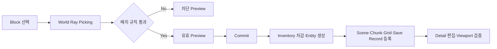
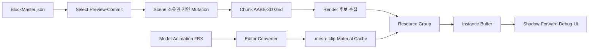
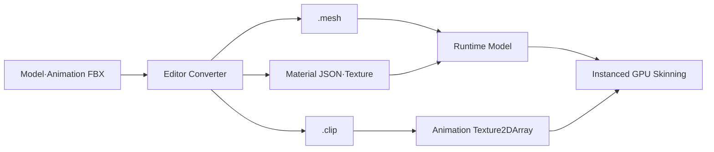
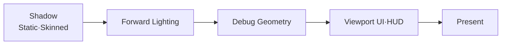

# Jellyto Studio

> **C++20과 Direct3D 11로 구현한 1인 3D Block Editor 프로젝트**입니다.  
> Block 배치 입력이 Scene 소유권, 공간 질의, Instance Group, GPU Buffer 제출로 이어지는 데이터 흐름과 FBX 선변환·GPU Skinning 파이프라인을 직접 설계했습니다.

## 프로젝트 개요

| 항목 | 내용 |
| --- | --- |
| 개발 기간 | 2026.03–2026.06 |
| 개발 인원 | 1인 개발 |
| 언어 | C++20 / HLSL |
| 플랫폼 | Windows / Win32 |
| Graphics API | Direct3D 11 |
| 개발 환경 | Visual Studio 2022 / v143 |

이 프로젝트는 범용 게임 엔진 제작을 목표로 하지 않습니다. **Editor에서 발생한 상태 변경을 안전한 경계에서 반영하고, 공간 후보를 줄인 뒤 동일 Resource를 묶어 GPU에 제출하는 과정**을 직접 구현하는 데 초점을 두었습니다.

## 핵심 결과

| 항목 | 측정·구현 결과 | 해석 범위 |
| --- | --- | --- |
| Instance 제출 | 대표 10,000 Block Scene을 `InstancingManager` 기준 Mesh 1회 + Model 3회, 총 **4 Draw**로 제출 | Shadow·Debug·UI를 포함한 전체 Frame Draw 수가 아님 |
| Frustum Culling | Render 후보 **10,001 → 3,656**, 63.4% 감소 | 동일 Preset에서 Frustum Toggle만 변경 |
| Fully-enclosed 검사 | Render 후보 **4,061 → 1,461**, 64.0% 감소 | 6방향 Grid 점유가 가능한 정적 Block 대상 |
| Skeletal Rendering | Geometry·Animation Texture를 공유하고 Clip·Frame·Tween을 Instance별로 전달 | 동일 Model의 Instance별 GPU Skinning |

> 위 수치는 FPS 또는 Frame Time 향상률이 아니라, 동일 조건에서 **Render 후보와 제출 Instance 수가 줄어든 비율**입니다.

---

## Editor 사용 흐름



Preview 단계에서는 Ray Hit, 허용 Collision Channel, 배치 Face, Collider Extent, Character 중첩을 검사하되 Scene 상태는 변경하지 않습니다. 모든 조건을 통과한 위치에서 클릭을 확정한 경우에만 Inventory를 차감하고 Entity와 Save Record를 생성합니다.

이 경계를 통해 다음 불일치를 방지했습니다.

- 화면에는 Preview가 보이지만 실제로는 배치할 수 없는 상태
- 실패한 배치가 Scene 또는 Save 데이터에 남는 상태
- Item·Collider·Material·저장 복원 규칙이 서로 다른 Type 기준을 사용하는 상태

---

## 전체 데이터 흐름



---

## 1. Scene 소유권과 지연 Mutation

`Scene`이 `std::unique_ptr<Entity>`로 객체 수명을 소유합니다. Update 또는 Render 순회 중 Add·Remove 요청이 발생하면 즉시 Container를 변경하지 않고 Pending 목록에 저장한 뒤, 순회가 끝난 안전한 시점에 반영합니다.

```cpp
void Scene::Add(std::unique_ptr<Entity> object)
{
    if (!object)
        return;

    if (IsIterating())
    {
        _pendingAdds.push_back(std::move(object));
        return;
    }

    AddImmediate(std::move(object));
}

void Scene::FlushPendingMutations()
{
    if (IsIterating())
        return;

    for (Entity* object : _pendingRemoves)
        RemoveImmediate(object);
    _pendingRemoves.clear();

    auto pendingAdds = std::move(_pendingAdds);
    _pendingAdds.clear();

    for (auto& object : pendingAdds)
        AddImmediate(std::move(object));
}
```

실제 변경이 확정되는 경계에서 다음 상태를 함께 갱신합니다.

- Scene 소유 목록
- Collider 등록 상태
- Chunk·Grid 공간 인덱스
- Camera Sort / Visibility Dirty
- Instancing Group Dirty

목적은 순회 중 Container 변경에 따른 Crash 방지뿐 아니라, **Collision·Culling·Renderer가 같은 Frame의 Entity 상태를 참조하도록 변경 시점을 통일하는 것**입니다.

---

## 2. `BlockMaster.json`을 기준으로 한 데이터 주도 확장

Block Type별 분기를 Item Window, Preview, Collider, Material, Save·Load에 반복하지 않도록 `BlockMaster.json`을 단일 정의 기준으로 사용합니다.

```json
{
  "key": "Priming1",
  "renderType": "Model",
  "modelName": "Priming_01",
  "collider": "Unit",
  "ownChannel": "Priming",
  "pickable": ["Priming", "Floor", "Character"],
  "faces": ["Top", "Side"]
}
```

시작 시 `BlockTable`이 문자열 속성을 Runtime Enum과 Bit Mask로 변환하고, 각 시스템은 동일한 `BlockRecord`를 조회합니다.

| 데이터 | 사용 경로 |
| --- | --- |
| `id` · `key` · 표시 정보 | Item Window · Palette · Save Record |
| `renderType` · `modelName` · `modelScale` | Mesh·Model 생성과 초기 크기 |
| `collider` · `ownChannel` | 배치 중심 계산과 Collision 등록 |
| `pickable` · `faces` | World Ray 후보와 허용 면 판정 |
| `paletteU` · `paletteV` | Atlas UV와 Instance Material Index |

새 Block은 데이터와 필요한 Resource를 추가해 확장하며, Tool Window마다 Type 분기를 복제하지 않습니다.

---

## 3. 공간 인덱스를 공유하는 질의 구조

`ChunkManager`는 XZ Chunk AABB와 3차원 Grid 점유 정보를 함께 유지합니다. 이 구조를 렌더링 최적화 전용으로 두지 않고 Picking과 Collision Broad Phase에도 공유했습니다.

| 사용 경로 | 공간 인덱스의 역할 |
| --- | --- |
| Frustum Culling | Camera Frustum과 교차하지 않는 Chunk 전체 제외 |
| Fully-enclosed 검사 | 6방향 Grid가 모두 점유된 정적 Block을 Render 후보에서 제외 |
| Ray Picking | Ray가 통과할 수 있는 Chunk와 Collider만 Hit 후보로 검사 |
| Collision Broad Phase | 전체 Scene이 아닌 인접 공간의 Collider 후보 전달 |

Fully-enclosed 검사는 Face Mesh를 다시 생성하는 방식이 아닙니다. 격자형 정적 Block의 6방향이 모두 막힌 경우 해당 Entity를 Instance Buffer 후보에서 제외합니다. 임의 회전 Mesh나 비격자 Geometry를 처리하는 범용 Occlusion Culling으로는 사용하지 않습니다.

---

## 4. Resource Group과 Instance Buffer 제출

Culling이 GPU에 전달할 후보 수를 줄인다면, Instancing은 남은 후보를 동일 Resource 단위로 묶어 객체 수가 아닌 Group 수만큼 Draw합니다.

| Renderer | Instance Group Key | 목적 |
| --- | --- | --- |
| `MeshRenderer` | Mesh × Material × Chunk | 동일 Resource를 묶고 공간 변경의 Dirty 범위를 Chunk로 제한 |
| `ModelRenderer` | Model × Shader | 동일 Geometry와 Shader Binding 공유 |
| `ModelAnimator` | Model × Shader | Geometry·Animation Texture 공유, Animation 상태만 Instance별 전달 |

Group 변화 범위에 따라 갱신 경로를 분리했습니다.

| 갱신 경로 | 선택 조건 | 처리 |
| --- | --- | --- |
| Full Rebuild | Scene 구조 또는 Model·Shader Group 전체 변경 | Group Cache와 InstanceData 전체 재구성 |
| Smart Group Rebuild | Visible Set 또는 특정 Mesh Group 멤버 변경 | 변경 Group만 재구성하고 동일 Group은 Skip |
| Partial Update | Group 구성은 같고 일부 Transform만 변경 | 해당 InstanceID의 Matrix만 갱신 |

장기 유지 Group은 필요한 Instance 수에 따라 Tier Buffer를 선택하고, 동적 Group은 3개의 Ring Slot을 순환하는 공유 `DynamicInstancePool`에 기록합니다.

```text
Frame Begin: Map 1회
  -> Group A Append
  -> Group B Append
  -> Group C Append
Frame End: Unmap 1회
  -> 각 Group이 보관한 Offset으로 Draw
```

Group마다 Map·Unmap하던 책임을 Frame 수명으로 이동해, Group 수가 늘어도 API 호출 구조가 `Map 1회 → Append N회 → Unmap 1회`로 유지되도록 구성했습니다. GPU Stall 감소율은 별도로 측정하지 않았습니다.

---

## 5. FBX 선변환과 Instance별 GPU Skinning

Runtime에서 FBX를 직접 해석하지 않고 Editor Converter가 프로젝트 전용 Cache를 생성합니다.

| 변환 결과 | 포함 데이터 | Runtime 역할 |
| --- | --- | --- |
| `.mesh` | Bone 계층·Offset Matrix·Vertex·Index·Skin Weight | Skeleton과 Vertex·Index Buffer 구성 |
| `.clip` | Frame Rate·Frame Count·Bone Channel Transform | Animation Texture 생성 |
| Material JSON | Material 속성과 Texture 경로 | Shader Resource Binding |
| Texture | Diffuse·Normal 등 이미지 | Texture / SRV 생성 |



같은 Model을 사용하는 Character는 Geometry와 Animation Texture를 공유합니다. Instance에는 현재·다음 Clip, Frame, Tween Ratio만 전달하고 Vertex Shader가 `instanceID`로 각 Animation 상태를 선택합니다.

Animation Texture는 다음 기준으로 Packing합니다.

- Array Slice: Animation Clip
- Y: Frame, 최대 500
- X: Bone Matrix Row, 최대 250 Bone × 4 Texel
- Instance Data: 현재·다음 Clip, Frame, 보간 Ratio

Model FBX와 Animation FBX의 Bone 이름이 Namespace 또는 Assimp Pivot Suffix 때문에 달라지는 문제는 Raw Name을 먼저 조회하고, 알려진 Suffix와 Namespace를 제거한 정규화 이름으로 재조회하도록 해결했습니다.

`.mesh`와 `.clip`은 범용 교환 포맷이 아니라 Jellyto Studio Runtime 전용 Cache입니다. Source FBX가 변경되면 Editor에서 다시 변환하는 흐름을 전제로 합니다.

---

## 6. Frame Pipeline과 Viewport



- 방향광 Shadow는 Editor Scene 범위에 맞춘 고정 2-Cascade 구조입니다.
- Static과 Skinned Instance 모두 Resource Group 단위로 Shadow Pass에 제출합니다.
- Skinned Shadow와 Forward Pass는 같은 Animation Texture와 Tween Data를 사용합니다.
- Viewport UI는 Orthographic Pass로 분리해 3D Depth·Lighting State와 섞이지 않도록 했습니다.
- Tool·Item·Detail·Chunk Debug Window는 Win32 Native Window로 분리했습니다.

---

## 대표 트러블슈팅

### Camera 이동 시 불필요한 Cache 전체 재구성

기존에는 Visible Set이 바뀌면 Mesh·Model·Animator Cache를 모두 Dirty 처리했습니다. 공간 후보 수집은 한 번만 수행하되 Mesh와 Model 계열의 Visibility Hash를 별도로 계산하고, 실제로 변경된 Renderer 계열에만 Dirty 신호를 전달하도록 수정했습니다.

검증 범위는 HUD의 계열별 Rebuild Count를 통해 **불필요한 재구성 경로가 선택되지 않는지** 확인하는 것이며, CPU·GPU Frame Time 감소율은 주장하지 않습니다.

### FBX Bone 이름 차이로 인한 Animation Channel 연결 실패

`Armature:Hips`, `Hips_$AssimpFbx$_PreRotation`, `Hips`처럼 의미상 같은 Bone이 서로 다른 문자열로 들어오는 문제를 확인했습니다. Raw Name과 정규화 Name을 Bone Index Map에 함께 등록하고, 규칙 밖 이름은 Debug Output에 남겨 Source Asset을 추적할 수 있게 했습니다.

---

## 프로젝트 구조

```text
Project_JellytoStudio/
├─ Client/        # Editor App, Block 배치, Inventory, Viewport HUD
├─ Engine/        # Scene, Entity, Collision, Rendering, Resource, Tool Window
├─ Libraries/     # 프로젝트 의존 Library와 Header
├─ Resources/     # Model, Texture, Shader, Block 정의 데이터
├─ Saved/         # Scene 저장 데이터
├─ outputs/       # 측정·검증 출력
└─ JellytoStudio.sln
```

## 빌드 및 실행

### 요구 환경

- Windows 10/11 x64
- Visual Studio 2022
- MSVC v143
- Windows SDK 10
- Direct3D 11 지원 GPU

### 빌드

```text
1. JellytoStudio.sln 열기
2. Debug | x64 또는 Release | x64 선택
3. Solution Build
4. Binaries/x64/<Configuration>/Client.exe 실행
```

Client Project는 x64 구성에서 C++20을 사용합니다. Assimp와 FMOD Runtime DLL은 Post-build 단계에서 실행 폴더로 복사되며, 저장소의 `Libraries`와 `Resources` 경로를 유지해야 합니다.

## 적용 범위

- Win32·Direct3D 11 기반 단일 Editor 프로젝트에 맞춘 구조입니다.
- 범용 ECS, API 독립 RHI, 범용 Asset Format을 목표로 하지 않습니다.
- 4 Draw는 `InstancingManager`가 집계한 대표 Scene의 Resource Group 제출 수입니다.
- Culling 수치는 Render 후보 감소율이며 FPS·Frame Time 향상률이 아닙니다.
- GPU Stall, 전체 Frame Draw, 다중 Hardware 환경 성능은 별도로 측정하지 않았습니다.

## 라이선스

Copyright (c) 2026 Jellyto Studio. All rights reserved.
